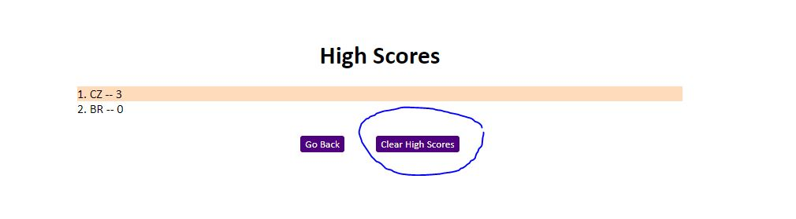

# Mock Quiz for Javascript

## Your Task
A 10-question quiz about Javascript. Your goal is to answer all 10 questions in 60 seconds -- are you ready to test your Javascript knowledge?

## Rules

```
1. You have 60 seconds to answer 10 questions about Javascript
2. Each question answered correctly will give you 1 point
3. Each question answered incorrectly will subtract 10 seconds from your timer
```

## High Scores

```
High scores will be recorded each time you submit your initials and scores after a game.

**Note: If you do not submit your score, it will not be recorded in the high score list!**

You may clear all high scores by clicking on the "Clear High Scores" button:

```



## User Story

```
AS A coding boot camp student
I WANT to take a timed quiz on JavaScript fundamentals that stores high scores
SO THAT I can gauge my progress compared to my peers
```

## Acceptance Criteria

```
GIVEN I am taking a code quiz
WHEN I click the start button
THEN a timer starts and I am presented with a question
WHEN I answer a question
THEN I am presented with another question
WHEN I answer a question incorrectly
THEN time is subtracted from the clock
WHEN all questions are answered or the timer reaches 0
THEN the game is over
WHEN the game is over
THEN I can save my initials and my score
```

